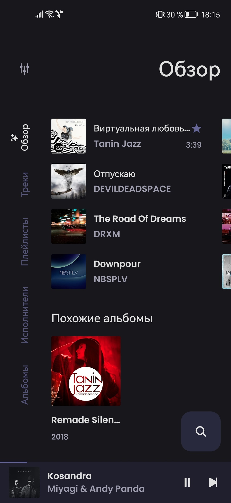
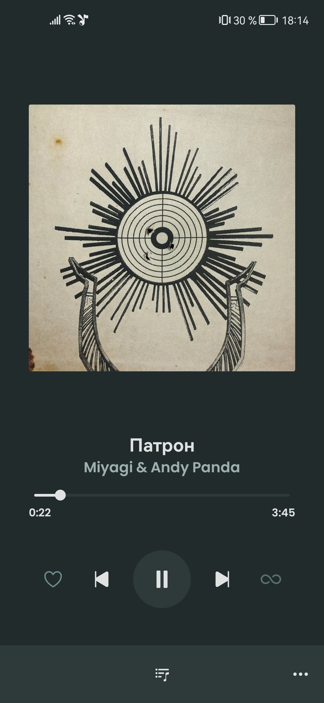
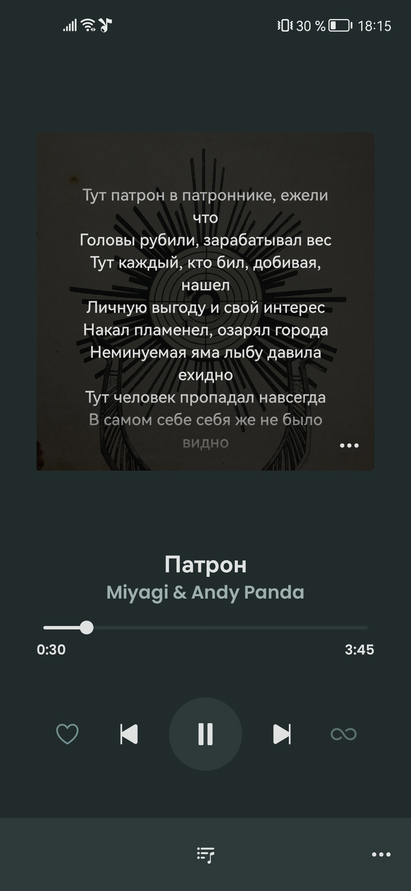
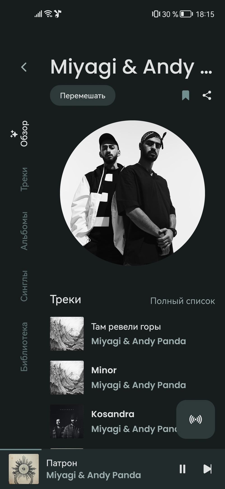
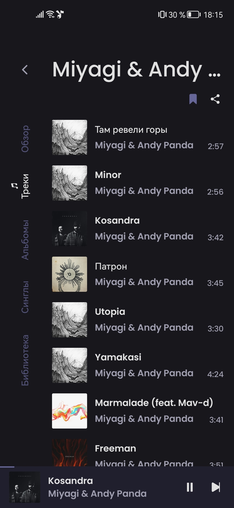
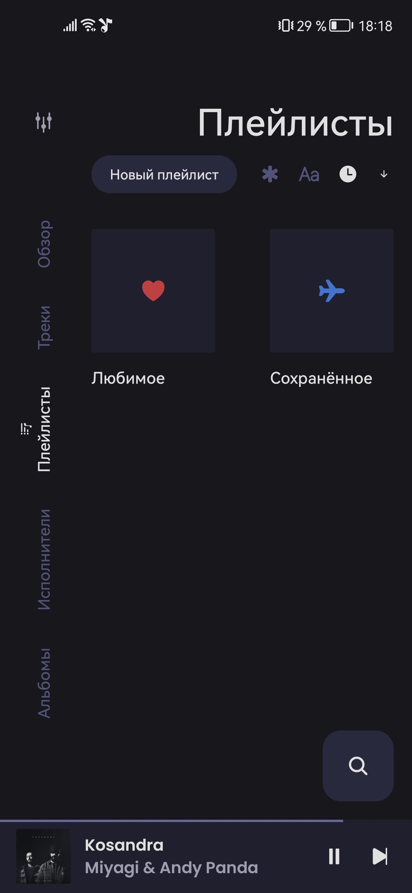

    
    <h1>Muza</h1>
    
Стриминговый музыкальный плеер на Android

     

---

  
  
  
    
  
  
  

## Функции
- Воспроизведение (почти) любой песни или видео с YouTube Music
- Фоновое воспроизведение
- Кэшируйте аудиофрагменты для автономного воспроизведения
- Поиск песен, альбомов, видео исполнителей и списков воспроизведения
- Добавляйте в закладки исполнителей и альбомы
- Импорт плейлистов
- Извлекайте, отображайте и редактируйте тексты песен или синхронизированные тексты.
- Управление локальным плейлистом
- Изменить порядок песен в плейлисте или очереди
- Светлая/темная/динамическая тема
- Пропуск тишины
- Таймер сна
- Нормализация звука
- Поддержка Андроид Авто
- Постоянная очередь
- Открывать ссылки на YouTube/YouTube Music (`смотреть`, `плейлист`, `канал`)
- ...

## Скачать

## Благодарности
- [**vfsfitvnm**](https://github.com/vfsfitvnm): Создатель оригинального приложения.
- [**ViMusic**](https://github.com/vfsfitvnm/ViMusic): Оригинальный репозиторий.
- [**YouTube-Internal-Clients**](https://github.com/zerodytrash/YouTube-Internal-Clients): Python скрипт для использования скытого API Youtube.
- [**ionicons**](https://github.com/ionic-team/ionicons): Иконки ручной работы премиум-класса, созданные Ionic, для приложений Ionic и веб-приложений по всему миру.

## Дисклеймер
Этот проект и его содержимое не связаны, не финансируются, не санкционированы, не одобрены и каким-либо образом не связаны с YouTube, Google LLC или какими-либо ее аффилированными и дочерними компаниями.

Любая торговая марка, знак обслуживания, торговое наименование или другие права на интеллектуальную собственность, используемые в этом проекте, принадлежат соответствующим владельцам.
